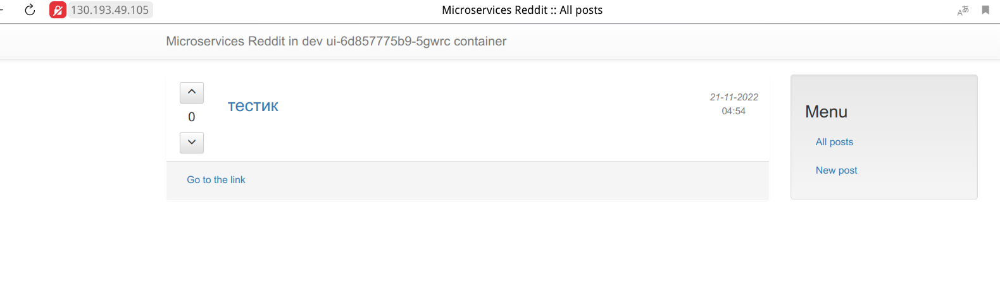
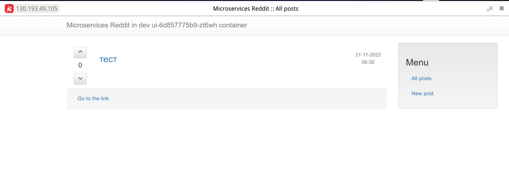
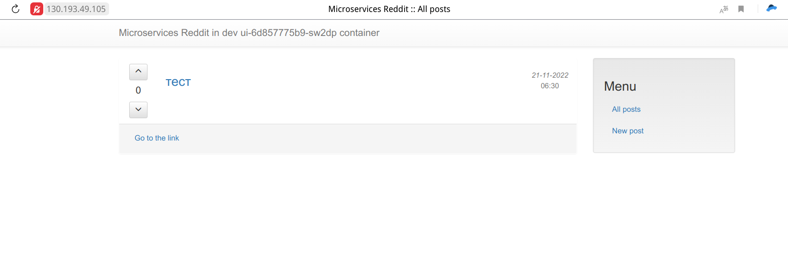
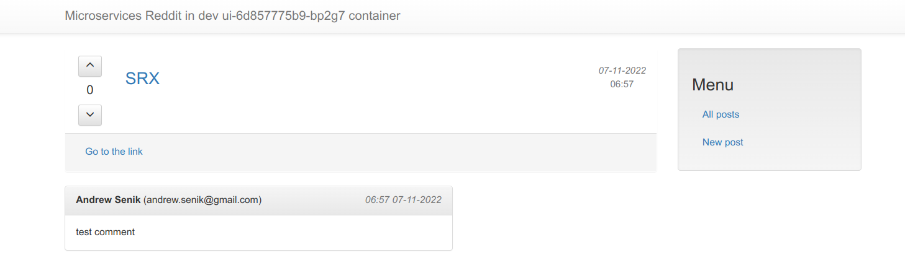
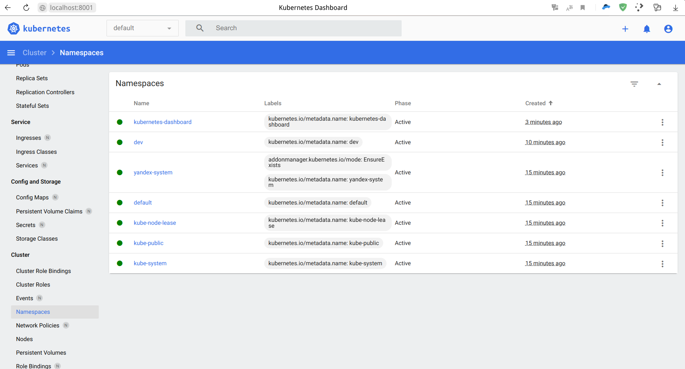
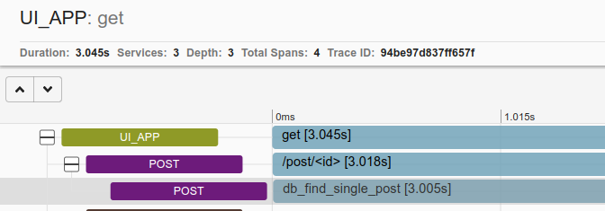
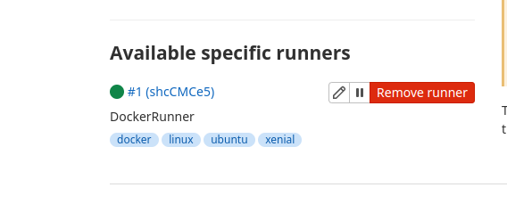
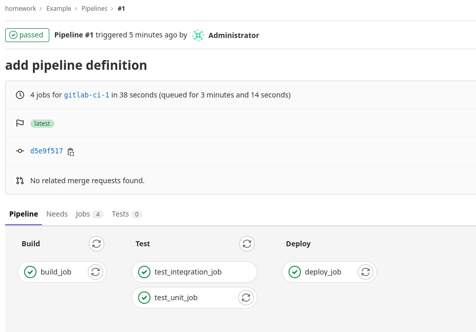
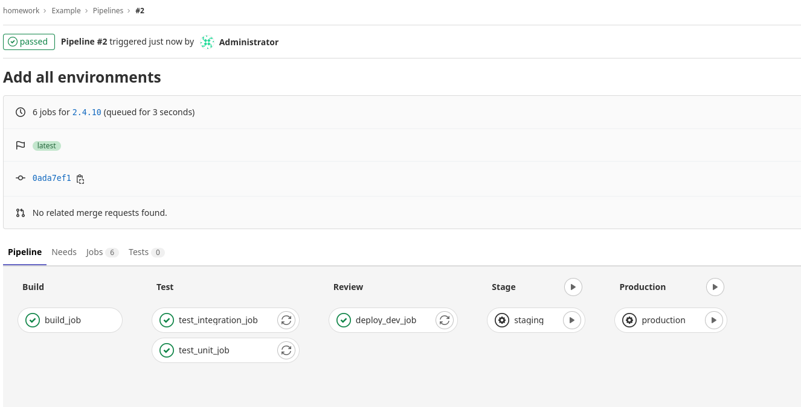
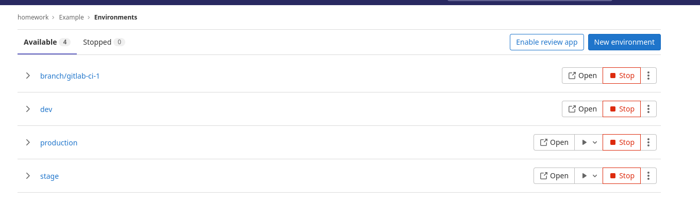

# rasdark_microservices

rasdark microservices repository

## Выполнено ДЗ №21

<details>
  <summary>Решение</summary>

- [x] Основное ДЗ
- [x] Дополнительное ДЗ

## В процессе сделано


## Ход решения

**ВНИМАНИЕ**: работа велась с helm3 чартами. Приложение отлажено с ними. CI, использующие helm2 - переделан не был (исправлены ошибки и autodevops).


Развернули кубер-кластер и подкинули инфу о нем в локальный конфиг kubectl

```
cd ./kubernetes/terraform2
terraform apply
yc managed-kubernetes cluster get-credentials k8s-dev --external --force
```

Ингресс в облако

```
helm repo add ingress-nginx https://kubernetes.github.io/ingress-nginx
helm repo up
helm install ingress-nginx ingress-nginx/ingress-nginx
```

Подглядели за External-IP для ingress-nginx-controller c типом LoadBalancer, например тут
```
kubectl get services -n default -o wide ingress-nginx-controller
```

Редактим файл ./kubernetes/Charts/gitlab/gitlab-values.yaml:
- в hosts.domain вписываем EXTERNAL_IP.sslip.io
- в hosts.externalIP вписываем EXTERNAL_IP


Раскатка гитлаба

```
helm repo add gitlab https://charts.gitlab.io/
helm repo up
helm install gitlab gitlab/gitlab --wait --timeout 700s -f ../Charts/gitlab/gitlab-values.yaml

```

Мониторим пока все поды поднимутся (в среднем 10-15 минут)

```
watch -n1 kubectl get pods
```

Получаем рутовый пароль

```
kubectl get secret gitlab-gitlab-initial-root-password -ojsonpath='{.data.password}' | base64 --decode ; echo
```

Логинимся в https://gitlab.EXTERNAL_IP.sslip.io/ и... Ура =)

Добавляем по методичке репозитории в группу.

Настраиваем переменные: замена переменных из методички одной DOCKER_AUTH_CONFIG, где auth взять из локального ~/.docker/config.json

```
{
    "auths": {
        "https://index.docker.io": {
            "auth": "...."
        },
        "https://index.docker.io/v1/": {
            "auth": "..."
        },
        "https://index.docker.io/v2/": {
            "auth": "..."
        },
        "index.docker.io/v1/": {
            "auth": "..."
        },
        "index.docker.io/v2/": {
            "auth": "..."
        },
        "docker.io/repo/myimage": {
            "auth": "..."
        }

    }
}
```

Чтобы посмотреть и отладить работу review и deploy стейджей, требуется интегрировать текущий кубер-кластер в гитлаб.

Для нужно, например, в reddit-deploy создать .gitlab/agents/agent-reddit/config.yaml примерно с таким содержанием

```
gitops:
  manifest_projects:
  - id: 'rasdark/reddit-deploy'
    paths:
    - glob: 'manifests/**/*.{yaml,yml,json}'
ci_access:
  groups:
  - id: rasdark
```

Закоммитить и запушить в мастер.

Сходить в настройки проекта Infrastructure -> Kubernetes clusters, нажать там большую синюю кнопку Connect a cluster
Выбрать в выпадающем списке agent-reddit и жмякнуть Register.

Предложат установить gitlab-agent в кубер-кластер. Копипастим и выполняем примерно такой текст:

```
helm upgrade --install agent-reddit gitlab/gitlab-agent \
    --namespace gitlab-agent \
    --create-namespace \
    --set image.tag=v15.6.0 \
    --set config.token=6Y7RzKA_sw5kCFXmuotX4Wofsw_CFd-BCeQ3hDRFYq3GUBvNyA \
    --set config.kasAddress=wss://kas.158.160.46.157.sslip.io
```

Готово. Можно отлаживать CI


В итоге, полученные пайплайны разнесены в соответствующие директории src/.

Пайплайн для reddit-deploy в корне Charts

Дополнительно в gitlabci/ перенесены все пайпы под именем gitlab-ci-\*.yaml


</details>

## Выполнено ДЗ №20

<details>
  <summary>Решение</summary>

- [x] Основное ДЗ
- [x] Дополнительное ДЗ

## В процессе сделано

- Осуществлены на практике разные способы доступа к приложению извне: NodePort, LoadBalancer, Ingress
- Познакомился на практике с Ingress Controller
- Познакомился на практике с SSL Терминацией в Ingress'ах
- Как в ingress можно "спрятать" секреты (TLS сертификаты, ключи) (задание с ★)
- Познакомился на практике с базовыми Network Policy
- Познакомился на практике с "постоянным хранилищем" для сервисов БД

## Как проверить

### Развернуть кластер и задеплоить приложение в Яндекс Облако

Внимание, часть параметров terraform унесена в переменные окружения.

Развернуть кубер-кластер
```bash
cd ./kubernetes/terraform2
terraform init
terraform apply

yc managed-kubernetes cluster get-credentials k8s-dev --external --force
```

Создать в Облаке ресурс диск, сохранить id, подставить в mongo-volume.yml

```bash
yc compute disk create  --name k8s-pvs  --zone ru-central1-a  --size 4  --description "disk for k8s"
yc compute disk list | grep k8s-pvs | awk '{print $2}'
sed -i 's/id-to-replace/fhm3ncj7icnc2a4amo6u/' ../reddit/mongo-volume.yml
```

Установить Ingress Controller
```bash
kubectl apply -f https://raw.githubusercontent.com/kubernetes/ingress-nginx/controller-v0.34.1/deploy/static/provider/cloud/deploy.yaml
```

Развернуть поды приложения

```bash
kubectl apply -f ../reddit/dev-namespace.yml
kubectl apply -n dev -f ../reddit/
```

Ждём поды

```bash
watch -n1 kubectl get pods -n dev
```

Ждём публикацию ingress =)

```bash
kubectl get ingress -n dev
```

Подключаемся по https://address

Скриншоты:

Работа приложения через ingress c ssl termination


Persistent Storage после создания


Persistent Storage после пересоздания



### Удалить ресурсы

```bash
terraform destroy
yc compute disk delete --name 'k8s-pvs'
```
</details>

## Выполнено ДЗ №19

<details>
  <summary>Решение</summary>

- [x] Основное ДЗ
- [x] Дополнительное ДЗ

## В процессе сделано

- Разворачивание и использование minikube локально на Gentoo (docker, podman, qemu, virtualbox)
- Деплой приложения reddit в локальный кубер
- Знакомство с сервисом dashboard + описание манифестов для разворачивания в кубер кластер
- Разворачивание Kubernetis Managed в Yandex.Cloud + описание с помощью terraform
- Деплой приложения в кубер-кластер в яндекс облаке


## Как проверить

### Развернуть кластер и задеплоить приложение в Яндекс Облако

Внимание, часть параметров terraform унесена в переменные окружения.

```bash
cd ./kubernetes/terraform2
terraform init
terraform apply

yc managed-kubernetes cluster get-credentials k8s-dev --external
kubectl apply -f ../reddit/dev-namespace.yml
kubectl config current-context
kubectl apply -n dev -f ../reddit/
```

Ожидаем пока поднимутся поды приложения:

```bash
watch -n1 kubectl get pods -n dev
```

Ищем адрес и порт приложения и подключаемся дабы проверить результат :)

```bash
kubectl get nodes -o wide
kubectl describe service ui -n dev | grep NodePort
```




### Dashboard

Идём по адресу: https://kubernetes.io/docs/tasks/access-application-cluster/web-ui-dashboard/

Забираем файл по ссылке и добавляем в описание сервиса NodePort.

Далее разворачиваем, получаем токен, подключаемся и проверяем.

```bash
cd kubernetes/dashboard
kubectl apply -f dashboard.yml
kubectl get deployments -n kubernetes-dashboard
kubectl get services -n kubernetes-dashboard

kubectl apply -f admin-sa.yml
kubectl apply -f dashboard-admin.yml

export ADMIN_NAME="kube-admin"
kubectl -n kube-system describe secret $(kubectl -n kube-system get secret | grep ${ADMIN_NAME} | awk '{print $1}')

```

Сохраняем токен в буфер обмена

Запускаем прокси:

```bash
kubectl proxy
```

Переходим по ссылке: http://localhost:8001/api/v1/namespaces/kubernetes-dashboard/services/https:kubernetes-dashboard:/proxy/



</details>

## Выполнено ДЗ №18

<details>
  <summary>Решение</summary>

- [x] Основное ДЗ
- [x] Дополнительное ДЗ

## В процессе сделано

- Собран и исследован кубер-кластер "вручную"
- Запущены недоделанные подики приложения
- Дополнительное задание: разврачивание кубер-кластера terraform + ansible

## Как проверить

Развернуть кубер-кластер

```bash
cd kubernetes/terraform && terraform init && terraform apply
```

Подключиться к мастеру

```bash
ssh -i ~/.ssh/appuser ubuntu@178.154.205.54
```

Посмотреть список нод:

```bash
kubectl get nodes
```

</details>

## Выполнено ДЗ №17

<details>
  <summary>Решение</summary>

- [x] Основное ДЗ
- [x] Дополнительное ДЗ

## В процессе сделано

- Всё по методичке
- Все дополнительные задания

## Как проверить

Создаём инстанс

```bash
yc compute instance create   --name logging   --memory=6   --zone ru-central1-a   --network-interface subnet-name=default-ru-central1-a,nat-ip-version=ipv4   --create-boot-disk image-folder-id=standard-images,image-family=ubuntu-1804-lts,size=15   --ssh-key ~/.ssh/appuser.pub
```

Создаём докер-машин

```bash
docker-machine create   --driver generic   --generic-ip-address=130.193.49.159   --generic-ssh-user yc-user   --generic-ssh-key ~/.ssh/appuser   logging
```

Подключаемся

```bash
eval $(docker-machine env docker-host)
```

Выполняем всё по методичке. Доходим удивительного опыта траблшутинга с помощью системы логирования и зипкина.

Собираем образы контейнеров с багованным кодом, правим docker_build скрипт (тегируем bugged), поднимаем новые контейнеры с приложением.

Идём на основную страничку - ок. Идём в любой пост - видим что описанная проблема реальна. Проваливаемся в зипкин и..



Видим реальную задержку, видим в каком контейнере (post), видим эндпоинт (/post) и зипкин спан нэйм (db_find_single_post).

Открываем основной код post-py (post_app.py), ищем по зипкин спан нейм, всматриваемся в код и видим, что какой-то молодец установил задержку в 3 сек с помощью sleep.

Убираем строчку (или камментим), пересобираем образ контейнера post, поднимаем контейнер, пытаемся воспроизвести баг - а его больше нет =)
</details>

## Выполнено ДЗ №16

<details>
  <summary>Решение</summary>

- [x] Основное ДЗ
- [x] Дополнительное ДЗ

## В процессе сделано

- Всё по методичке
- Все дополнительные задания

## Как проверить

Создаём инстанс

```bash
yc compute instance create   --name docker-host   --memory=8   --zone ru-central1-a   --network-interface subnet-name=default-ru-central1-a,nat-ip-version=ipv4   --create-boot-disk image-folder-id=standard-images,image-family=ubuntu-1804-lts,size=50   --ssh-key ~/.ssh/appuser.pub
```

Создаём докер-машин

```bash
docker-machine create   --driver generic   --generic-ip-address=51.250.10.50   --generic-ssh-user yc-user   --generic-ssh-key ~/.ssh/appuser   docker-host
```

Подключаемся

```bash
eval $(docker-machine env docker-host)
```

Собираем образы, пушим в хаб, запускаем докеры

```bash
cd monitoring && make
```

</details>

## Выполнено ДЗ №15

<details>
  <summary>Решение</summary>

- [x] Основное ДЗ
- [x] Дополнительное ДЗ

## В процессе сделано

- Все по методичке

## Возникшие проблемы

В процессе работы возникла только одна проблема: не хватка памяти при запуске теста в раннере.
Решение: пересоздать инстанс в облаке с 8Гб ОЗУ.

## Как проверить

Создаем инстанс

```bash
yc compute instance create   --name gitlab-host   --memory=8   --zone ru-central1-a   --network-interface subnet-name=default-ru-central1-a,nat-ip-version=ipv4   --create-boot-disk image-folder-id=standard-images,image-family=ubuntu-1804-lts,size=50   --ssh-key ~/.ssh/appuser.pub
```

Правим инвентори

Разворачиваем GitLab

```bash
cd gitlab-ci/ansible && ansible-playbook gitlab_prepare.yml
```

Ждём пару-тройку минут. Идём по урлу <http://внешний_адрес_>инстанса - ГитЛаб работает.

Ищём рутовй пароль гитлаба, вариантов несколько, самый простой, в лоб:

```bash
ssh -i ~/.ssh/appuser yc-user@178.154.203.135 sudo grep -i "password:" /srv/gitlab/config/initial_root_password
```

Логинимся в гитлаб, отключаем регистрацию, ищем токен регистрации раннера.

Создаём контейнер с раннером и регистрируем в гитлабе.

```bash
ansible-playbook -e 'GITLAB_TOKEN="GR1348941BHDrqFq_t8zrTJ2P3jsq"' gitlab_runner.yml
```



Сразу добавляем интеграцию со слак: зовём webhook integration, получаем вебхук урл, вгоняем в настройки в гитлаб интегрейшен, жмякаем кнопки на что тригерриться гитлабу, сохраняем.

Работу моего веб-хука посмотреть можно тут: [C03KQ35UW4A](https://devops-team-otus.slack.com/archives/)





</details>

## Выполнено ДЗ №14

<details>
  <summary>Решение</summary>

- [x] Основное ДЗ
- [x] Дополнительное ДЗ: docker-compose.override

## В процессе сделано

- Разобрался с работой сетей в докере
- Работа с docker-compose
- docker-compose.override

### Docker Compose

Параметризация осуществляется путем создания из .env.example - .env с заполнением переменных.

Имя проекта формируется из имени корневой папки для docker-compose.yml (src). Переопределить можно
2мя способами:

```bash
docker-compose -p Имя-проекта up -d
```

Задание переменной COMPOSE_PROJECT_NAME в .env

### Docker-compose.override

Чтобы не тащить каталоги проекта на docker-host, сборку сделал на localhost.

</details>

## Выполнено ДЗ №13

<details>
  <summary>Решение</summary>

- [x] Основное ДЗ
- [x] Дополнительное ДЗ: переопределение сетевых алиасов и запуск контейнеров с передачей переменных окружения
- [x] Дополнительное ДЗ: оптимизация образов с использованием в качестве базового alpine

## В процессе сделано

- Подготовка docker-host.
  Так как в предыдущем ДЗ работали с packer (который в процессе работы создаёт сеть), сети все
  удалили. Поэтому сперва создадим их:

  ```shell
  yc vpc network create default --description "Default network"
  yc vpc subnet create default-ru-central1-a --zone ru-central1-a --network-name default --range 10.121.0.0/24
  ```

  Создадим инстанс в Ya.Cloud

  ```shell
  yc compute instance create \
    --name docker-host \
    --zone ru-central1-a \
    --network-interface subnet-name=default-ru-central1-a,nat-ip-version=ipv4 \
    --create-boot-disk image-folder-id=standard-images,image-family=ubuntu-1804-lts,size=15 \
    --ssh-key ~/.ssh/appuser.pub
  ```

  Затем я столкнулся с проблемой при добавлении хоста в docker-machine (отуствие **netstat** на хосте).
  Которая решается просто:

  ```shell
  ssh -i ~/.ssh/appuser yc-user@51.250.78.165 'sudo apt install net-tools'
  ```

  После этого с docker-machine всё хорошо =)

  ```shell
  docker-machine create \
    --driver generic \
    --generic-ip-address=51.250.78.165 \
    --generic-ssh-user yc-user \
    --generic-ssh-key ~/.ssh/appuser \
    docker-host
  ```

- Подготовка исходников микросервисов, подготовка и сборка докер-образов.

  На этом этапе столкнулся с проблемой:
  При попытке собрать образ сервиса post-py словил ошибку установки модуля MarkupSafe.
  Ошибка решилась просто добавлением шага обновление pip в докер-файле (древниве версии pip не умеют в Python-Requires метаданные)

- Создание сети, запуск контейнеров в указанной сети. Проверка работы приложения
- Задание с * (переопределение сетевых алиасов и запуск контейнеров с передачей переменных окружения)

```shell
docker run -d --network=reddit --network-alias=my_post_db --network-alias=my_comment_db mongo:latest

docker run -d --network=reddit --network-alias=my_post --env POST_DATABASE_HOST=my_post_db rasdark/post:1.0
docker run -d --network=reddit --network-alias=my_comment --env COMMENT_DATABASE_HOST=my_comment_db  rasdark/comment:1.0
docker run -d --network=reddit -p 9292:9292 --env POST_SERVICE_HOST=my_post --env COMMENT_SERVICE_HOST=my_comment rasdark/ui:1.0
```

- Оптимизация образа сервиса ui с использованием в качестве базового образа - ubuntu:16

  Результат:

  ```shell
  REPOSITORY        TAG            IMAGE ID       CREATED          SIZE
  rasdark/ui        2.0            35c85db41635   17 seconds ago   464MB
  rasdark/ui        1.0            b7c473ac91ba   17 minutes ago   771MB
  ```

- Задание с *: оптимизация образов с использованием в качестве базового alpine

  Результат UI:

  ```shell
  REPOSITORY        TAG            IMAGE ID       CREATED          SIZE
  rasdark/ui        3.0            3741e0adbefc   5 seconds ago    266MB
  rasdark/ui        2.0            35c85db41635   11 minutes ago   464MB
  rasdark/ui        1.0            b7c473ac91ba   28 minutes ago   771MB
  ```

  Результат COMMENT:

  ```shell
  REPOSITORY        TAG            IMAGE ID       CREATED          SIZE
  rasdark/comment   2.0            7fde219e1bfb   11 seconds ago   263MB
  rasdark/comment   1.0            21dae36d6770   35 minutes ago   769MB
  ```

  С сервисом POST-PY накладочка =) В методичке уже был оптимизированный образ на базе alpine

  Итого:

  ```shell
  CONTAINER ID   IMAGE                 COMMAND                  CREATED         STATUS         PORTS            NAMES
  1767fa65cb7f   rasdark/comment:2.0   "puma"                   3 seconds ago   Up 1 second                       lucid_lumiere
  b2f46f7beb32   rasdark/ui:3.0        "puma"                   5 minutes ago   Up 4 minutes   0.0.0.0:9292->9292/tcp, :::9292->9292/tcp   loving_ritchie
  72eeb0576601   rasdark/post:1.0      "python3 post_app.py"    5 minutes ago   Up 5 minutes                       agitated_jepsen
  9b50aa8faadb   mongo:latest          "docker-entrypoint.s…"   5 minutes ago   Up 5 minutes   27017/tcp           mystifying_fermi
  ```

- Создание тома, подключение тома к контейнеру с монгой, проверка работы приложения в целом (с остановкой контейнера с базой)

</details>

## Выполнено ДЗ №12

<details>
  <summary>Решение</summary>

- [x] Основное ДЗ
- [x] Дополнительное ДЗ: сказ о разнице между образом и контейнером
- [x] Дополнительное ДЗ: инфраструктура приложения с помощью packer, terraform, ansible

### В процессе сделано

- Установка, настройка, работа с docker, docker-machine
- Настройка docker-machine для работы с докером внутри виртуалки в Яндекс.Облако
- Сборка образа на хосте в Облаке
- Работа с Docker Hub (регистрация, пуш, пул в локальную среду для проверки)
- Разработана инфраструктура приложения с помощью packer, terraform, ansible

### Задания с *

Разница между образом и контейнером описана в файле docker-1.log

Инфраструктура подготовлена в **infra/**

Для проверки работы инфраструктуры необходимо:

- Создать базовый образ с установленным докером с помощью packer.

```shell
cd infra/packer
packer build -var-file=variables.json docker.json
```

- Указать необходимое число инстансов в terraform.tfvars (переменная instance_count)
- Подготовить инстансы с помощью terraform

```shell
cd ../terraform
terraform apply
```

- Задеплоить приложение с помощью ansible

```shell
cd ../ansible
ansible-playbook playbooks/docker_run.yml
```

</details>
